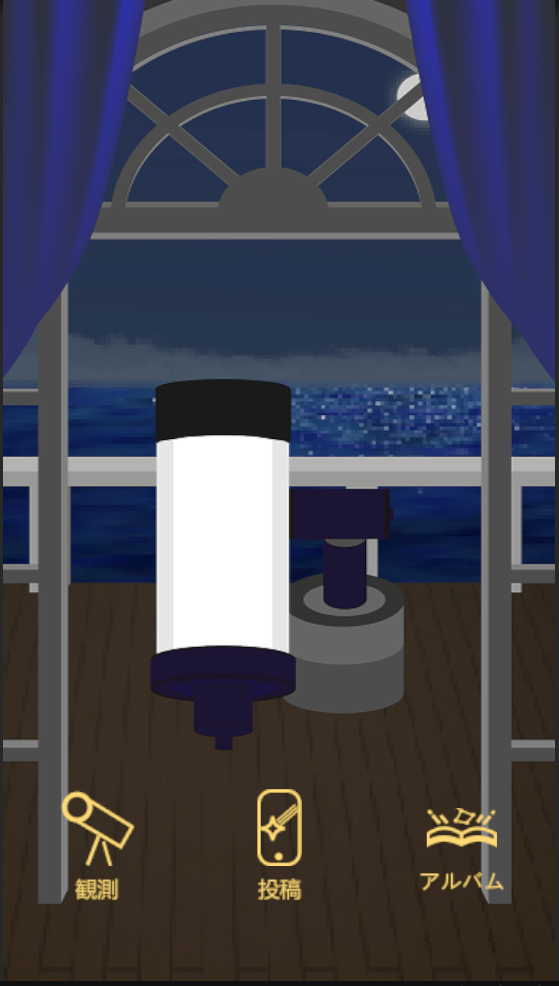
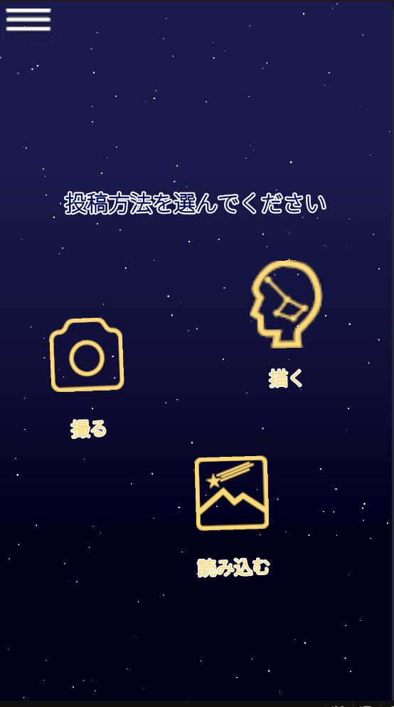

# P2HACKS2025 アピールシート

## プロダクト名

## コンセプト
自分の星座を投稿してつながる完全匿名性SNSアプリ

## 対象ユーザ
Instagramに壁を感じているTwitter（X）ユーザー 
新しいSNSを求めている方

## 利用の流れ
- タイトル画面
- ホーム画面
　以下の3つの画面に移動ができる 
  ↳投稿
  ↳観測
  ↳アルバム
- 観測（みんなの投稿）画面
みんなの投稿（流れ星含め）とコメントを見ることができ、いいねや返信が可能、他の返信も閲覧可能 
また、右上の☆ボタンを押すことで流れ星として投稿することが可能
- アルバム（自分の投稿）画面
自分の過去の投稿を見ることができる

- 投稿画面
投稿ができる画面、最初に以下の3つの選択肢が提示され選んだ方法に沿って星座を投稿できる。 
　↳写真を撮る
　↳写真を選ぶ
　↳星座を描く

- 左上にハンバーガーボタン（三本線）
タイトル画面以外のどの画面にも存在し押すと以下の4つの選択ができ選んだ画面に移動する。 
　↳ホーム
　↳観測
　↳投稿
　↳アルバム

## 推しポイント
星座をテーマにしたつぶやきシステム 
完全匿名性なところ 
写真を星座化することによって写真がもつキラキラを均一化する

## スクリーンショット(任意)

## 開発体制

### 役割分担
バックエンド：しゅうと 
フロントエンド：じゅんや、しゅうと、しょうや 
デザイン：ゆずな、あやと 
発表資料作成：ゆずな、あやと、しょうや

### 開発における工夫した点
スケジュールをあらかじめ早めに設けることで余裕をもてるようにした。 
UIが単調にならないように心掛けた。 
全体的に見やすいように心掛けた。 
文字を極力減らした。

## 開発技術

### 利用したプログラミング言語
- C#

### 利用したフレームワーク・ライブラリ
フレームワーク
- Unity
- Firebase
ライブラリ
- Firebase SDK
- Unityの標準ライブラリ
- UniTask
- OpenCV plus Unity
- Native Camera for Android & iOS
- Native Gallary for Android & iOS

### その他開発に使用したツール・サービス
- Github
- Gemini
- Firebase
- Illustrator
- Unity
- Sourcetree
- Visual Studio 2022
- Visual Studio 2026
- Visual Studio Code
- DOTween(HOTween V2)